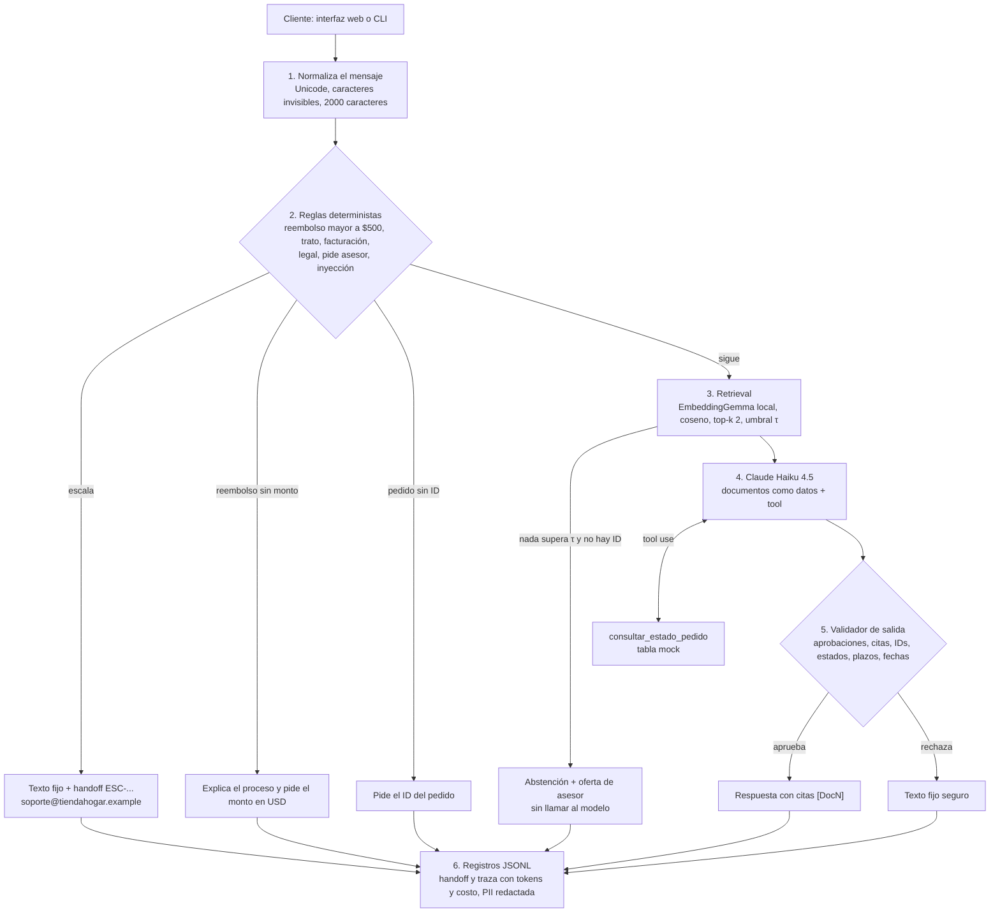

## Arquitectura propuesta y justificación

Morpho es un paquete de Python con un núcleo que orquesta cada turno y tres formas de usarlo: una interfaz web local (`uv run morpho-ui`), un chat en la terminal (`uv run morpho`) y un servidor MCP que expone la tool (`uv run morpho-mcp`). Así corre un turno:



| Componente | Módulo | Qué hace |
|---|---|---|
| Orquestador | `agent.py` | Ejecuta los pasos en orden y guarda el estado de la conversación (historial, si espera un monto) |
| Reglas | `guardrails/rules.py`, `amounts.py` | Detectan los casos para humanos. El parser lee montos como `$1.200`, `1,200.50`, `USD 600` o "seiscientos dólares", e ignora IDs de pedido, fechas y cantidades |
| Retrieval | `retrieval/` | Embeddings locales con caché versionado, store en numpy y umbral calibrado |
| Modelo | `llm/` | Puerto `LLMClient`, adaptador de la Messages API con loop de tools propio y `FakeLLM` para pruebas |
| Validador | `guardrails/output_validator.py` | Revisa cada borrador antes de que lo vea el cliente |
| Tool | `tools/orders.py` | `consultar_estado_pedido(order_id: str) -> dict` con la firma exacta del reto; la misma función se publica por MCP |
| Registros | `records.py` | Handoffs con referencia y trazas por turno con atributos `gen_ai.*` de OpenTelemetry |

**Por qué este diseño:**

- **Las reglas corren antes del retrieval y del modelo.** Escalar un reembolso de $800 no puede depender de lo que el modelo decida. Además, al medir los embeddings sobre los documentos reales, las preguntas del Doc 5 (trato, facturación, temas legales) sacaron los scores más bajos de todo el set: un guardrail apoyado en el retrieval fallaría justo en esos casos. Las reglas son código testeable, y el tema que escala nunca llega al modelo: si el mensaje trae además otra pregunta, solo esa parte se le envía.
- **Un validador después del modelo.** Que el prompt diga "no apruebes reembolsos" no alcanza. Si el borrador aprueba un reembolso, cita un documento que no se recuperó, menciona un pedido o un estado que no se consultó en ese turno, o da un plazo o una fecha que no está en las fuentes, el cliente recibe un texto fijo seguro.
- **Abstención sin modelo.** Si ningún documento supera el umbral y el mensaje no trae un ID de pedido, Morpho responde con un texto fijo y ofrece un asesor. Así no gasta tokens ni inventa.
- **Sin framework de agentes.** El adaptador de Claude, con su loop de tools, tiene unas 90 líneas y está detrás del puerto `LLMClient`. El núcleo no conoce al proveedor: el plan original usaba OpenAI y, cuando la compra de esa key falló, el cambio a Claude solo tocó `llm/`, la configuración y los embeddings. En Foundry solo cambia cómo se construye el cliente.
- **Todo se puede medir.** 315 pruebas offline, 11 en vivo y un golden set de 55 casos con un juez (sección de pruebas).

**Trade-offs por el límite de tiempo:**

- Reglas por palabras y patrones en vez de un clasificador entrenado: son predecibles y auditables, pero no captan paráfrasis (ver limitaciones).
- Claude Haiku 4.5 como modelo del agente: unos 2 segundos y USD 0.002 por turno, a cambio de algo de apego a las reglas en casos límite, que el juez detecta.
- Vector store en numpy y estado de la conversación en memoria. Alcanza para 5 documentos y un proceso; en producción va a Azure AI Search o Databricks.
- Interfaz web local y mínima, sin autenticación: escucha solo en 127.0.0.1.

### Supuestos sobre las políticas

1. Los reembolsos mayores a $500 se derivan a soporte@tiendahogar.example; el Doc 4 no nombra un canal.
2. "Mayores a $500" es estricto: $500 exactos no escalan.
3. Morpho nunca aprueba reembolsos: explica el proceso o deriva.
4. Si el monto viene en otra moneda o no se entiende, Morpho pide el monto en USD; no convierte monedas.
5. Un número sin moneda se lee como dólares, porque el Doc 4 fija el límite en dólares. Un número menor a 10 se lee como cantidad ("devolver 2 licuadoras").
6. Una devolución o una solicitud de aprobación que nombra un monto cuenta como solicitud de reembolso ("apruébame $800").
7. Un electrodoméstico que no aparece en las listas del Doc 1 (por ejemplo, un microondas) no se clasifica: se dan ambas reglas y se ofrece un asesor.
8. Ante la duda, se escala: escalar de más es el error barato.
9. Los documentos se usan textuales, sin editar.

## Decisiones técnicas de RAG

- **Chunking:** no. Los documentos tienen entre 20 y 55 palabras y cada uno trata un solo tema, así que cada documento es un vector. Partirlos separaría reglas que dependen entre sí, como la excepción de liquidación del plazo de 30 días en el Doc 2. Con miles de documentos:
  - Partiría primero por estructura (títulos, secciones, cláusulas) y después de forma recursiva, en fragmentos de 300 a 512 tokens con 10% a 25% de solape.
  - A cada fragmento le antepondría el título y la ruta de sección, o usaría contextual retrieval.
  - Buscaría con fragmentos chicos y le pasaría al modelo la sección completa.
  - Guardaría metadatos de vigencia, versión, país e idioma, y permisos, para no responder con una política vieja ni mostrar lo que el cliente no debe ver.
  - Usaría búsqueda híbrida (vectores y BM25) con reranking.
  - En el stack de Grupo Mariposa, el chunking iría en una tabla Delta de Unity Catalog antes de indexar.
- **Embeddings:** EmbeddingGemma (`google/embeddinggemma-300m`), local con fastembed y ONNX Runtime: 768 dimensiones, unos 17 ms por consulta en CPU, sin API key y sin costo por llamada. Antes de elegir, medí cinco opciones sobre los documentos reales:

  | Modelo | Top-1 correcto |
  |---|---|
  | EmbeddingGemma-300m | 16/16 |
  | Qwen3-Embedding-0.6B | 16/16 |
  | multilingual-e5-small | 14/16 |
  | BM25 en español | 13/16 |
  | MiniLM multilingüe | 12/16 |

  EmbeddingGemma fue el más liviano de los que acertaron todo, y entiende español e inglés. Qwen3-Embedding-0.6B queda como alternativa porque Databricks lo sirve, pero es unas seis veces más lento por consulta. Uso los prompts del model card: uno para preguntas y otro para documentos. Los vectores de los documentos y de las 41 preguntas etiquetadas están en un caché versionado, así que las pruebas corren con vectores reales sin descargar el modelo.
- **Threshold de recuperación:** coseno con τ = 0.334 y top-k 2.
  - **Calibración:** τ es el punto medio entre el score más alto de 10 preguntas fuera del dominio (0.272) y el más bajo de 31 dentro del dominio (0.397). Eso deja una separación de 0.125 y el documento correcto primero en 31 de 31.
  - **Preguntas excluidas:** las 3 preguntas del Doc 5 que escalan por regla no cuentan, porque nunca llegan al retrieval.
  - **Segundo documento:** se usa solo si también supera τ y está a menos de 0.1 del primero. Así "si devuelvo la licuadora, ¿cuándo me reembolsan?" trae el Doc 2 y el Doc 4.
  - **Si ningún documento supera τ:**
    - Si el mensaje trae un ID de pedido, el modelo responde solo con la tool.
    - Si no, Morpho no llama al modelo: responde con un texto fijo ("No tengo esa información en las políticas de TiendaHogar"), dice en qué temas puede ayudar y ofrece un asesor en soporte@tiendahogar.example.
  - **Por modelo:** τ se guarda por modelo en `thresholds.json` y se recalibra con un comando si cambian el modelo o el backend. Por ejemplo, Azure AI Search reporta el coseno en otra escala.

## Pruebas automatizadas

```bash
uv run pytest tests/
```

315 pruebas en un segundo, sin red ni API key. El modelo se reemplaza por `FakeLLM` y los embeddings salen del caché versionado. `uv run pytest -m challenge` corre solo los tres casos que pide el reto.

- **Los tres casos que pide el reto:**
  - **Retrieval:** `tests/test_retrieval.py::test_clear_question_retrieves_its_document_first`. Con los vectores reales, cada documento sale primero para su pregunta, por ejemplo garantía → Doc 1. Otra prueba verifica que las 41 preguntas etiquetadas quedan del lado correcto de τ.
  - **Tool:**
    - **ID válido:** `tests/test_orders.py::test_order_in_transit_reports_product_status_and_estimated_delivery`.
    - **ID inexistente:** `::test_unknown_order_is_not_found_without_invented_data` devuelve "no encontrado" sin producto ni estado.
    - **Formato inválido:** `::test_malformed_id_is_rejected_without_reading_the_orders` rechaza `ORD-1001'; DROP TABLE` antes de leer la tabla.
  - **Guardrail:**
    - **Reglas:** `tests/test_rules.py::test_case_reserved_for_people_is_escalated`.
    - **Agente:** `tests/test_agent.py::test_case_reserved_for_people_is_escalated_without_the_model` verifica que el modelo recibe cero llamadas cuando una regla escala.
- **Además:**
  - **Montos:** 99 pruebas de reglas y montos: `$500` contra `$500.01`, `$1.200`, `$1 200`, `1,200.50`, palabras, centavos, otras monedas, IDs y teléfonos que no son montos, multi-turno.
  - **Validador de salida:** aprobaciones, citas, pedidos, plazos y fechas inventados.
  - **Inyección de prompts.**
  - **PII:** redacción en los registros.
  - **Servidor MCP:** misma salida que la función.
  - **Interfaz web.**
- **Escenarios en Gherkin:** cada escenario de `specs/` (11 archivos, en español) tiene su prueba.
- **Pruebas en vivo:** `uv run pytest -m live` corre 11 escenarios contra Claude, buscando hechos (estado, plazo, cita, idioma) y no texto exacto. También se corren desde la interfaz web.
- **Evaluación:** `uv run python -m morpho.evals.run_eval` corre un golden set de 55 casos que cubre 31 escenarios: montos límite, ingeniería social, inyección, inglés y multi-turno.
  - **Chequeos en código:** revisan el camino, los motivos de escalamiento, los pedidos consultados, las citas, frases obligatorias y prohibidas, el idioma y si se llamó al modelo.
  - **Juez:** Claude Sonnet 5.5 califica las respuestas que redactó el modelo con las cuatro rúbricas de los evaluadores de agentes de Foundry. Uso las rúbricas en vez del paquete `azure-ai-evaluation` porque este pide un juez de OpenAI o Azure OpenAI.
  - **Última corrida:** 55 de 55 casos pasan los chequeos. El juez dio estos promedios (escala 1 a 5):

    | Rúbrica | Promedio |
    |---|---|
    | Resolución de la intención | 4.76 |
    | Precisión de la tool | 5.00 |
    | Apego a las reglas | 4.44 |
    | Fundamentación | 4.68 |

    Costó USD 0.07 de agente y 0.25 de juez. El reporte está en [evals/report.md](evals/report.md).
- **CI:** GitHub Actions corre ruff, pyright y las pruebas offline en cada push.

## Cómo mapearías esto a producción

El núcleo (reglas, validador, orquestador) se queda igual: lo que cambia son los adaptadores que ya están detrás de interfaces.

| Prototipo | En el stack de Grupo Mariposa |
|---|---|
| Loop local en Python | Foundry hosted agent (envuelto con Microsoft Agent Framework), con versiones inmutables, identidad Entra por agente y tracing. Las reglas de escalamiento siguen en código dentro del agente. |
| Claude por la API de Anthropic | Claude en Microsoft Foundry con la misma Messages API: solo cambia `anthropic.Anthropic(...)` por `anthropic.AnthropicFoundry(...)`. Foundry no aplica sus filtros de contenido a Claude, así que las reglas y el validador son la capa principal de seguridad, no un extra. |
| 5 documentos + numpy | Documentos en ADLS → volúmenes y tablas Delta de Unity Catalog (dueño, versión, linaje, chunking) → índice en Foundry IQ / Azure AI Search, consultado por MCP. Alternativa con un solo plano de gobierno: Databricks AI Search con índice Delta Sync. Los vectores pueden venir de EmbeddingGemma servido en un endpoint propio o de la vectorización del buscador, y τ se recalibra para ese backend. |
| `consultar_estado_pedido` con tabla mock | API de lectura de pedidos publicada en Apigee como API product (OAuth2 con JWT de Entra, cuotas, spike arrest) y expuesta como tool MCP. Foundry la llama con la identidad del agente. El servidor valida que el pedido sea del cliente. |
| Handoff en un JSONL local | `POST /escalations` con `Idempotency-Key` → outbox transaccional → tópico Kafka `support.escalation.requested` → ticketing y aviso en Teams a los asesores. |
| Trazas en JSONL | OpenTelemetry (los atributos `gen_ai.*` ya están) → Application Insights y el panel de Foundry, con un ID de correlación Apigee → Foundry → Kafka. |
| Golden set local | Evaluaciones de Foundry como gate de CI antes de publicar una versión, evaluación continua y red teaming. |
| `.env` | Entra Agent ID, managed identity y Key Vault: sin secretos en código ni en prompts. |
| Interfaz web local | Web o WhatsApp detrás de Apigee para clientes; Teams para los asesores. |

**Eventos con Kafka:**

- **`support.escalation.requested`:** los casos derivados a un asesor.
- **`orders.status.changed`:** alimenta el modelo de lectura de pedidos.
- **`support.retrieval.miss`:** preguntas sin documento relevante, para encontrar huecos en las políticas.
- **`support.conversation.audited`:** se archiva en Unity Catalog como dataset de evaluación.

Las claves de los mensajes son `conversation_id` u `order_id`, para mantener el orden. Entrega al menos una vez, con consumidores que deduplican por clave de idempotencia.

**Riesgos a vigilar:**

- **Piezas en preview:** algunas siguen en preview, como los guardrails de agentes de Foundry y el MCP administrado de Databricks. La primera versión se apoya solo en piezas GA.
- **Prompt Shields:** Microsoft lo probó solo en inglés.
- **Validación de tokens:** falta comprobar que Apigee y Databricks validen los tokens de identidad del agente.
- **Gobierno:** inventario y dueño del agente, evaluación de impacto y la meta de no perder ningún caso que debe escalar, bajo NIST AI RMF e ISO/IEC 42001.

## Limitaciones conocidas

- **Las reglas no captan paráfrasis.** Una queja sin las palabras esperadas ("me hicieron sentir humillado en la tienda") puede no escalar. Lo mitigan tres cosas: el prompt indica derivar esos temas, el cliente puede pedir un asesor en cualquier momento y Morpho lo ofrece cuando no puede ayudar. En producción sumaría un clasificador multilingüe y red teaming en español.
- **Haiku a veces decide la elegibilidad por su cuenta.** En devoluciones y garantías concluye con lo que dice el cliente ("sí, puedes devolverla", "ese daño no está cubierto"), aunque el prompt le pide explicar la regla y ofrecer un asesor. El validador no detecta ese exceso porque no inventa datos; el juez sí (de 1 a 3 de 25 casos por corrida). La solución sería usar textos fijos para la elegibilidad o un modelo más fuerte en esas respuestas.
- **El validador revisa datos concretos, no todo el sentido.** Atrapa aprobaciones, citas, pedidos, estados (en español e inglés), plazos y fechas, pero no un paso de proceso inventado ni el producto de un pedido. Eso lo mide la evaluación, no la ejecución.
- **Resultados no deterministas.** Las pruebas en vivo y la evaluación pueden variar entre corridas; el reporte es una corrida.
- **Idiomas:** solo distingue español e inglés; cualquier otro idioma recibe la respuesta en español.
- **Estado y registros solo locales:**
  - Las conversaciones viven en memoria y se pierden al reiniciar.
  - Los registros de handoff son un archivo local que nadie consume.
  - La interfaz no tiene autenticación. Escucha solo en 127.0.0.1 y rechaza peticiones de otros sitios, para que una página abierta en el navegador no pueda usar la key.
- **Primera ejecución:** descarga EmbeddingGemma (1.2 GB) para embeber preguntas nuevas.
- **No probado:** carga y concurrencia, otros modelos de Claude como agente, y el despliegue real en Foundry, Apigee o Kafka.

## Tiempo invertido

Unas 15 horas:

| Etapa | Horas |
|---|---|
| Investigación, benchmark de embeddings, diseño (modelo C4 y specs en Gherkin) y plan | 5 |
| Tool y servidor MCP, guardrails, retrieval, orquestador y CLI | 5 |
| Cambio de OpenAI a Claude, calibración y pruebas en vivo | 1.5 |
| Evaluación con juez e interfaz web | 2.5 |
| Documentación y revisión | 1 |
